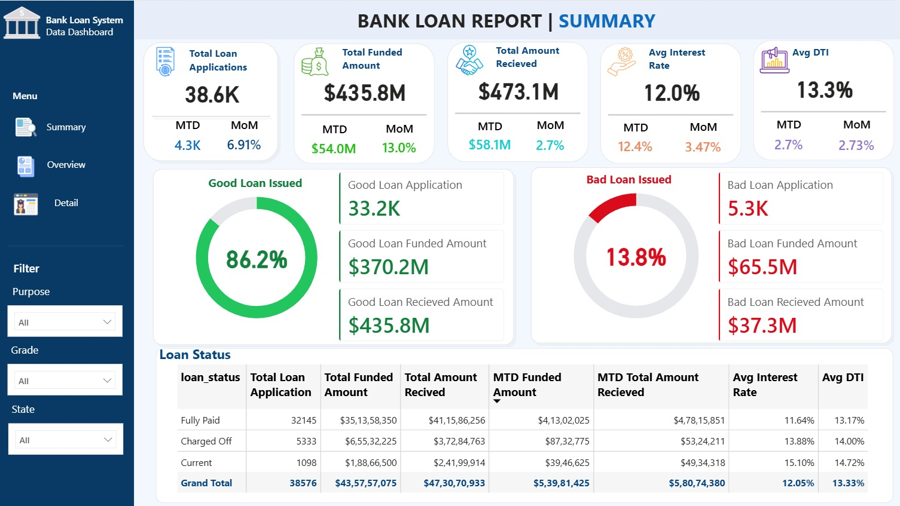
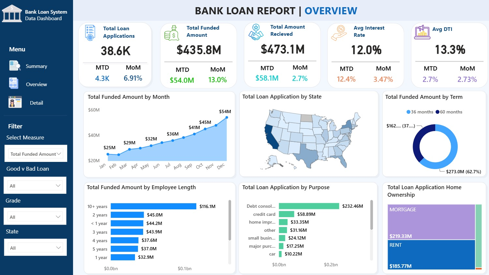
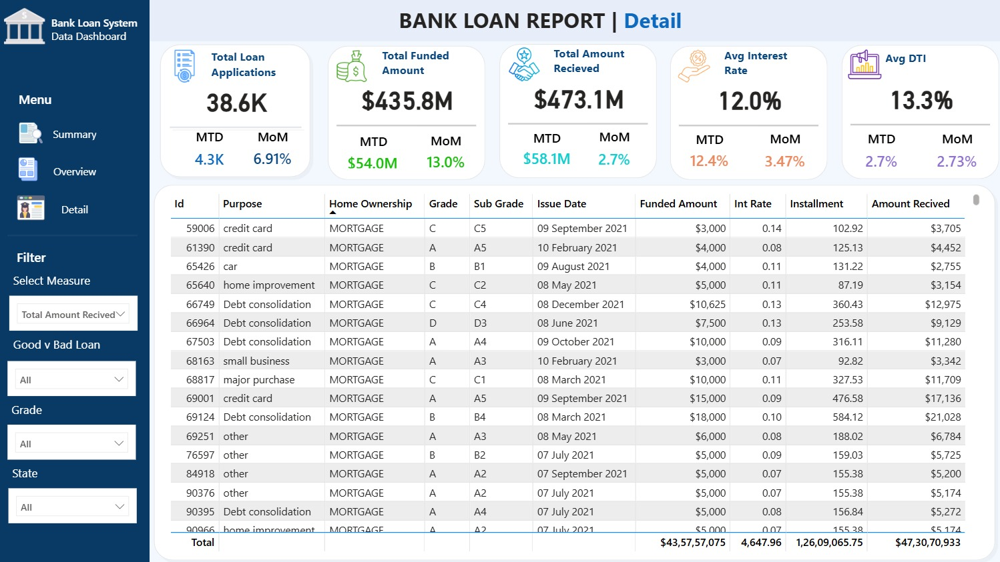

# 🏦 Bank Loan Analysis & Reporting Dashboard

## 📌 Project Overview

An end-to-end **Bank Loan Analysis and Reporting Dashboard** developed using **SQL Server and Power BI** to analyze loan applications, funded amounts, repayments, loan quality, borrower characteristics, and lending trends.

The project analyzes approximately **38K+ loan applications** and transforms raw loan data into interactive business intelligence dashboards to support data-driven lending decisions.

---

## 🎯 Business Objective

The objective of this project is to monitor and evaluate the bank's lending activities and portfolio performance.

The analysis focuses on:

* Loan application trends
* Funded and received amounts
* Loan quality
* Good vs Bad loans
* Interest rates
* Debt-to-Income Ratio (DTI)
* Regional lending patterns
* Loan purposes
* Loan terms
* Borrower employment length
* Home ownership

---

## 🛠️ Tools & Technologies

* **SQL Server**
* **SQL**
* **Power BI**
* **DAX**
* **Power Query**
* **Data Cleaning & Transformation**
* **Data Visualization**
* **Business Intelligence**

---

# 📊 Dashboard

The Power BI report consists of three interactive pages.

## 1️⃣ Summary Dashboard

The Summary dashboard provides a high-level view of the bank's loan portfolio.

### Key Performance Indicators

* **Total Loan Applications:** 38.6K
* **Total Funded Amount:** $435.8M
* **Total Amount Received:** $473.1M
* **Average Interest Rate:** 12.0%
* **Average DTI:** 13.3%

### Good vs Bad Loan Analysis

**Good Loans**

* Good Loan Applications: 33.2K
* Good Loan Percentage: 86.2%
* Good Loan Funded Amount: $370.2M
* Good Loan Amount Received: $435.8M

**Bad Loans**

* Bad Loan Applications: 5.3K
* Bad Loan Percentage: 13.8%
* Bad Loan Funded Amount: $65.5M
* Bad Loan Amount Received: $37.3M

The dashboard also includes a **Loan Status Grid** covering Fully Paid, Current, and Charged Off loans.

### Dashboard Preview



---

# 2️⃣ Overview Dashboard

The Overview dashboard provides visual analysis of major lending trends and borrower characteristics.

### Visualizations

* 📈 Monthly Loan Trends
* 🗺️ State-wise Loan Applications
* 🍩 Loan Term Analysis
* 📊 Employee Length Analysis
* 📊 Loan Purpose Analysis
* 🏠 Home Ownership Analysis

### Dashboard Preview



---

# 3️⃣ Details Dashboard

The Details dashboard provides a detailed view of individual loan records.

### Key Fields

* Loan ID
* Loan Purpose
* Home Ownership
* Loan Grade
* Sub Grade
* Issue Date
* Funded Amount
* Interest Rate
* Installment
* Amount Received

Interactive filters are available for:

* Select Measure
* Good vs Bad Loan
* Grade
* State

### Dashboard Preview



---

# 📈 Key Business Insights

### 1. Strong Good Loan Portfolio

Approximately **86.2% of loan applications are classified as Good Loans**, consisting of Fully Paid and Current loans.

### 2. Significant Loan Funding

The bank funded approximately **$435.8M** across the analyzed loan portfolio.

### 3. Higher Amount Received

The total amount received from borrowers is approximately **$473.1M**.

### 4. Bad Loan Exposure

Approximately **13.8% of applications are classified as Bad Loans**, representing Charged Off loans.

### 5. Debt Consolidation is the Leading Purpose

**Debt consolidation** represents the largest loan purpose by funded amount, indicating significant demand for debt restructuring.

### 6. Monthly Growth

Total funded amount increased throughout the year, reaching approximately **$54M in December**, compared with approximately **$25M in January**.

### 7. Loan Term Distribution

**36-month loans** represent a larger share of the funded amount compared with 60-month loans.

---

# 💻 SQL Analysis

SQL Server was used to perform the backend analysis and calculate key business metrics.

The SQL analysis includes:

* Total loan applications
* Month-to-Date applications
* Total funded amount
* Month-to-Date funded amount
* Previous month funded amount
* Total amount received
* Average interest rate
* Average DTI
* Loan status analysis
* Good loan percentage
* Good loan amount received
* Monthly loan performance

The complete SQL queries are available here:

📁 **[SQL/Bank_Loan_Analysis.sql](SQL/Bank_Loan_Analysis.sql)**

---

# 📂 Project Structure

```text
Bank-Loan-Analysis/
│
├── Dashboard/
│   ├── Summary.jpeg
│   ├── Overview.jpeg
│   └── Detail.jpeg
│
├── SQL/
│   └── Bank_Loan_Analysis.sql
│
├── Bank_Loan_Report.pbix
│
└── README.md
```

---

# 📊 Power BI Report

The complete Power BI report is available in:

**`Bank_Loan_Report.pbix`**

The report includes interactive filters, KPI cards, charts, maps, tables, and dashboard navigation.

---

# 🎓 Skills Demonstrated

This project demonstrates practical skills in:

* SQL querying
* Data aggregation
* Data analysis
* KPI development
* DAX
* Power Query
* Data modeling
* Data visualization
* Dashboard design
* Business intelligence
* Business insights generation

---

## 👨‍💻 Author

**Sasmit Seth**

Aspiring Data Analyst | SQL | Python | Power BI

---

⭐ If you found this project useful, feel free to explore the repository.

